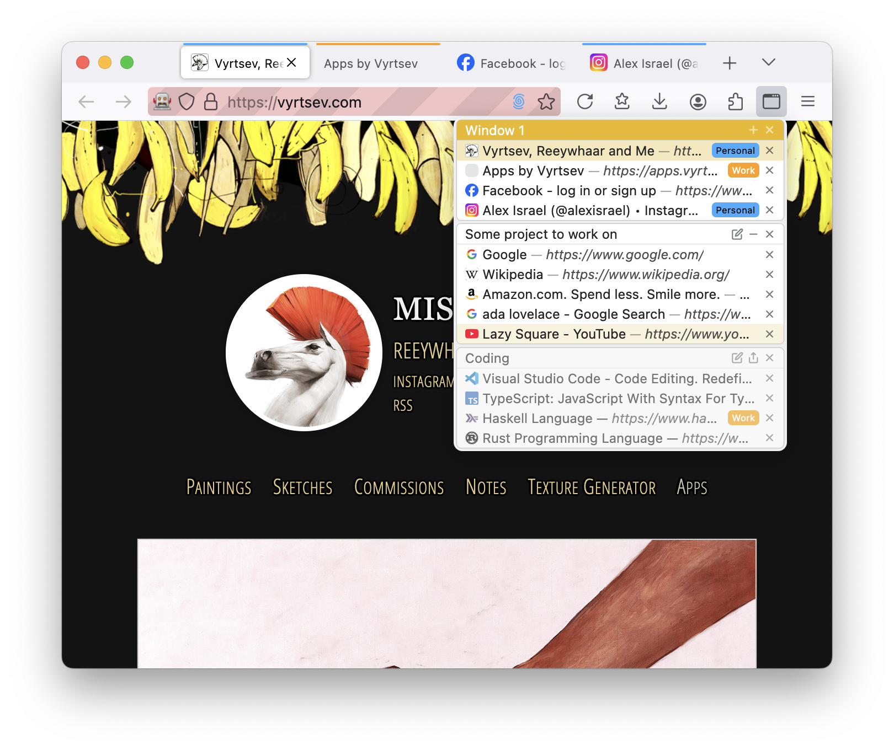

# TabSaver 2

# Tab Saver

WebExtension to manage your tabs.
With this extension you can save tabs in current window and open them later. It tracks tabs in opened windows, so if you save it as session (`+` icon on a window block), you can close the window and restore it later.

It is continuation of my [TabSaver](https://github.com/Reeywhaar/tabsaver) addon, but it is made simpler and there is no need to always save session when you want to close window. Sessions are tracked automatically.

Supports:

- Drag and drop between tab sessions, even without saving session it is useful to drag tabs between multiple windows.
- [Tab containers](https://support.mozilla.org/en-US/kb/how-use-firefox-containers)
- Tabs and window discarding, so you can put window or a tab in a "sleep" mode so it won't use cpu

# Install

[Install at Firefox Addons](https://addons.mozilla.org/en-US/firefox/addon/tabsaver-2/)

Additionally you can install it from [Releases](https://github.com/Reeywhaar/tabsaver-2/releases/latest)

### Caveats

Current state of Firefox WebExtension Api restricts opening of privileged urls (such as `file:///`, `chrome:`, `about:`, etc..) so placeholder page will be opened where you can copy link to clipboard and manually paste it into the location bar. Sad.

### Screenshots

## FAQ

#### What does `•` dot symbol before tab's link means?

It means that tab is pinned.

#### What is `Unknown` label near tab's link.

It means that tab's container was removed

#### Can I copy dragged tab? I do not want it to be removed from original session

You can duplicate it by holding `cmd (mac)` or `ctrl (Win/Linux)` key, just as same as when you drag file in windows manager.

#### Can I open TabSaver in sidebar?

Yes, look at **View -> Sidebar -> TabSaver**

# How to build

First install dependencies: `npm install`.

Second compile js with webpack `npm run compile:prod`

Then, If you want to build artifact: `./node_modules/.bin/web-ext build -s ext`. _this will create zip archive in ./web-ext-artifacts_

And If you want to run extension in dev mode: `./node_modules/.bin/web-ext run -s ext`

# CHANGELOG

## `v.0.0.12`

- Updated dependencies
- Fixed tests

## `v.0.0.11`

- Uploaded to Mozilla Addons

## `v.0.0.10`

- Added tab discard button

## `v.0.0.9`

- Added dark theme support
- Fixed copy-open of saved tab

## `v.0.0.8`

- Fixed error with extension build

## `v.0.0.7`

- Fix error by asserting cases

## `v.0.0.6`

- Added tracking for active tab in session

## `v.0.0.5`

- Added button to discard (freeze) window tabs
- Opening sessions tabs in discarded state (save resources)

## `v.0.0.4`

- Initial release. Some harsh moments are present but it gets work done

There were dragons...
